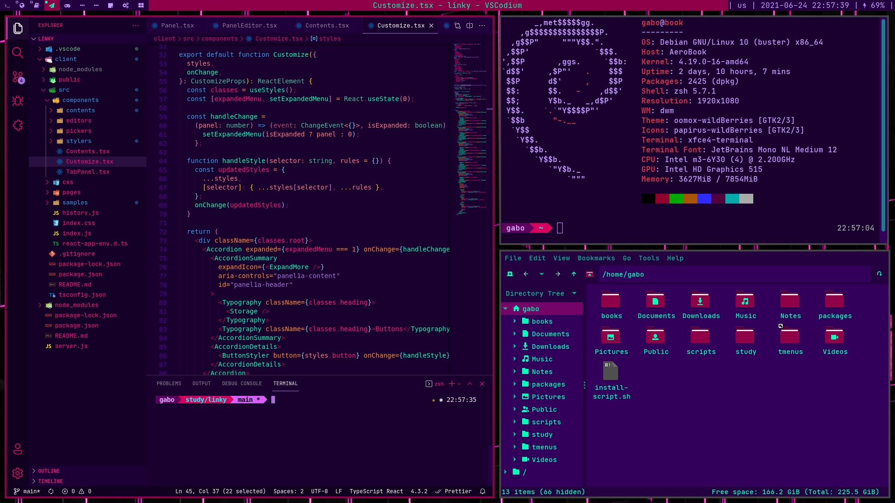

<div align="center">
    
```
gabo's repo of
██████╗  ██████╗ ████████╗███████╗██╗██╗     ███████╗███████╗
██╔══██╗██╔═══██╗╚══██╔══╝██╔════╝██║██║     ██╔════╝██╔════╝
██║  ██║██║   ██║   ██║   █████╗  ██║██║     █████╗  ███████╗
██║  ██║██║   ██║   ██║   ██╔══╝  ██║██║     ██╔══╝  ╚════██║
██████╔╝╚██████╔╝   ██║   ██║     ██║███████╗███████╗███████║
╚═════╝  ╚═════╝    ╚═╝   ╚═╝     ╚═╝╚══════╝╚══════╝╚══════╝
```
</div>



A repository to centralize all configuration files my workflow needs to behave the way It should.

Here you will find **shell** utilities, ui/**theming** configurations, and some applications **config files**.

## ℹ️ Details

- **Shell**: ZSH
- **WM**: dwm
- **Theme**: oomox-wildBerries
- **Icons**: papirus-wilBerries
- **Terminal**: st
- **Terminal Font**: JetBrains Mono NL Medium 12

## 📦 Expected Applications

Applications I use everyday for my workflow. You don't really need them to enjoy my dotfiles, but if you would like to know what I use.

|  Dependency  |                Description                |                                                  Installation                                                   |
| :----------: | :---------------------------------------: | :-------------------------------------------------------------------------------------------------------------: |
|    `dwm`     |              window manager               |              [my fork](https://github.com/gbgabo/dwm) or [project page](https://dwm.suckless.org/)              |
|   `dmenu`    |           application launcher            |         [my fork](https://github.com/gbgabo/dmenu) or [project page](https://tools.suckless.org/dmenu/)         |
|  `tsearch`   |             dmenu web search              |                              [project page](https://github.com/TinyToolSH/tsearch)                              |
|   `tmenu`    |           custom menu launcher            |                               [project page](https://github.com/TinyToolSH/tmenu)                               |
| `xwallpaper` |             wallpaper setter              |            check your distro repository or [project page](https://github.com/stoeckmann/xwallpaper)             |
|    `sxiv`    | image visualizer, used for wallpaper menu |                check your distro repository or [project page](https://github.com/muennich/sxiv)                 |
|   `dunst`    |            notification daemon            | [project page](https://github.com/dunst-project/dunst) (using recent version to support notification overwrite) |
|    `zsh`     |                   shell                   |                                          check your distro repository                                           |
|  `antigen`   |            zsh plugin manager             |              check your distro repository or [project page](https://github.com/zsh-users/antigen)               |

## ⚙️ Installation

My dotfiles are installed through dotbot, so you just need to `./install`

This script creates a symlink of each dotfile to its expected location on the system. Before instaling, check each linking target on `install.conf.yaml` and tweak them to better suit your system.

```yaml
# install.conf.yaml
- link:
    ~/.bashrc: shell/bashrc
    path/from/repo: path/to/system
```

More about [dotbot](https://github.com/anishathalye/dotbot)

## 🗃️ What's Inside

```sh
.dotfiles
├── 🗀 config                   # general applications config files
│   ├── dunstrc
│   ├── i3
│   │   ├── config
│   │   └── config_original
│   ├── neovim
│   │   └── init.vim
│   ├── vimrc
│   ├── vscodium-settings.json
│   └── Xorg
│       ├── xinitrc
│       └── Xresources
├── 🗀 shell                    # shell utils for a CLI workflow
│   ├── aliases
│   ├── bashrc
│   ├── functions
│   ├── wild-berries.zsh-theme
│   ├── zprofile
│   └── zshrc
├── 🗀 ui                       # theming and daily use ui components
│   ├── gtk-themes
│   │   └── oomox-wildBerries       # customized wildBerries gtk theme
│   ├── icons
│   │   ├── default
│   │   └── papirus-wildBerries     # customized wildBerries papirus icons
│   └── tmenus                      # custom quick menus
│       ├── dial.yaml
│       └── focus.yaml
├── gitconfig
├── install
├── install.conf.yaml
└── README.md
```

## ↗️ Other repositories to check

- [gbgabo/scripts](https://github.com/gbgabo/scripts): personal scripts for volume control, brightness;
- [gbgabo/dwm](https://github.com/gbgabo/dwm): own fork of dwm, including many useful patches and own color theme;
- [gbgabo/dmenu](https://github.com/gbgabo/dmenu): dmenu fork with center patch and own color theme;
- [TinyTools](https://github.com/TinyToolSH): mainly [tmenu](https://github.com/TinyToolSH/tmenu) and [tsearch](https://github.com/TinyToolSH/tsearch), each used as dmenu wrappers for custom menus and search, respectively;
- [gbgabo/wallpapers](https://github.com/gbgabo/wallpapers): dedicated repository for all my wallpapers;
- [WillPower3309/awesome-dotfiles](https://github.com/WillPower3309/awesome-dotfiles): This README is highly inspired by this repository, check out the awesome work of his.
